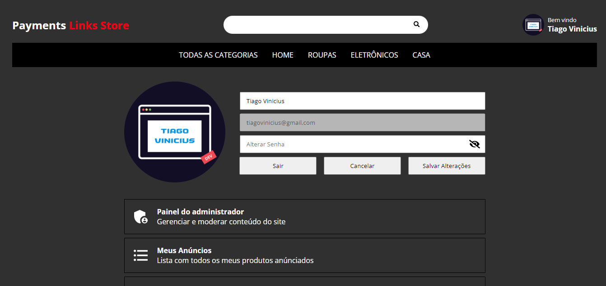

<h3>Informações Gerais</h3>

Projeto feito usando React no frontend e Node no backend

O Stripe é responsavel por processar os pagamentos

A aplicação consiste em uma loja, o usuário pode navegar entre os produtos e comprar o item desejado

Qualquer usúario cadastrato pode públicar produtos que então devem ser aprovados por algum administrador

<h3>Produtos</h3>

<h3>Tela de Login</h3>

<h3>Painel do Usuário</h3>

<h3>Publicar Produto</h3>

<h3>Tela de compra</h3>

Os pagamentos são processados pelo stripe

<h3>Painel do Administrador</h3>

Aqui os administradores podem alterar imagens dos sites, categorias, remover usuários e aprovar produtos

